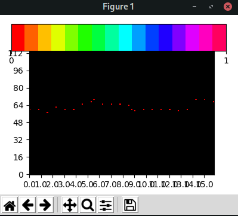

# <b>AI MUSIC GENERATION 
# <i>Created with Magenta
## ICT21 / Tekoäly | ohjelmointityö

### Miska Kytö - 17.3.2020

**Updated for Python 3.8+ compatibility (2025)**

Originally designed for Python 3.7, now updated to work with modern Python versions including Python 3.8, 3.9, 3.10, 3.11, and 3.12.

# How does it work? (or not)
Magenta on Googlen kehittämä tutkimusprojekti tekoälyn ja koneoppimisen käyttömahdollisuuksista musiikin ja taiteen aloilla. \
Magenta käyttää Googlen Tensorflow-kirjastoa koneoppimis-mallien luomiseen ja kehittämiseen.

Tämä ohjelma sisältää 3 Googlen valmiiksi kehittämää mallia, jotka sijaitsevat `models/` -kansiossa.
Näiden mallien pohjalta tekoäly luo 5 melodiaa .midi-muodossa `CreatedMidi/`-kansioon.
\
Kun käyttäjä kuuntelee melodian, se käännetään .wav-muotoon `CreatedWave/`-kansioon paremman yhteensopivuuden vuoksi. Wav-tiedoston soittamiseen käytetään PyGame-kirjastoa.
\
Samalla MatPlotLib-kirjaston avulla käyttäjälle piirretään visualisaatio Midi-tiedostosta "pianorullan" muodossa.
Tämä toiminnallisuus löytyy tiedostosta `roll.py`, ja se löytyy projektista: https://github.com/exeex/midi-visualization. Kyseinen projekti ja koodi on MIT-lisenssin alaista, ja sen omistaja on https://github.com/exeex

### Mahdolliset kehitysmahdollisuudet
1. Lisätä mallien määrää
2. Antaa mahdollisuus käyttäjälle luoda omia malleja vapaavalintaisen musiikin pohjalta
3. Tällä hetkellä kaikki melodiat alkavat "keski-C:stä", ja tulevaisuudessa käyttäjälle voisi antaa mahdollisuuden valita jokin toinen pohja melodialle.

# Käyttö
1. git clone
2. asenna vaaditut kirjastot\
   ```pip install -r requirements.txt```
3. ```python AI.py```

## Koodin toiminta toisilla koneilla ei varmistettu, ongelmat esim audiodrivereiden kanssa erittäin mahdollisia!
## <b>LINUX-YMPÄRISTÖN KÄYTTÖ ERITTÄIN VAHVASTI SUOSITELTUA

# <b> Ohjelman toiminta:

## Uusien melodioiden luominen: 
[](https://asciinema.org/a/uSeYTas4vBX2qU15H4Wjmrglg)

## Melodioiden kuunteleminen (Videossa ei audiota):
[](https://asciinema.org/a/EXUZG2MPVGhQARJS4JkzGEcFQ)

## Ohjelma myös piirtää visualisaation Midi-tiedostosta:
